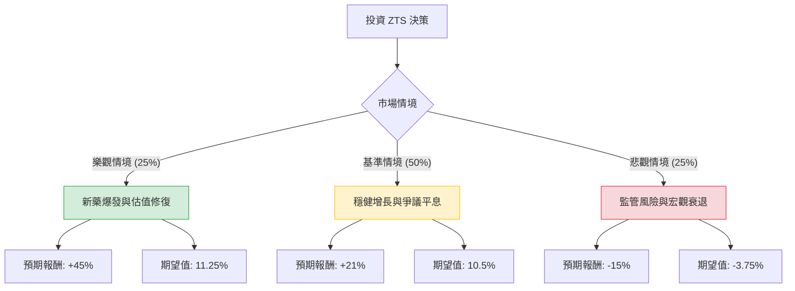

針對美股動物保健龍頭 **Zoetis (ZTS)** 的投資評估，我已結合您提供的基本面數據，並透過網路搜尋整合了最新的市場動態（如 2024 年 Q1 財報、Librela 安全性爭議、產業趨勢等）進行深度分析。

---

### 一、 最新市場動態與背景分析

1.  **最新財報表現 (2024 Q1)**：
    *   Zoetis 第一季營收達 22 億美元（年增 10%），調整後 EPS 為 1.38 美元，均優於市場預期。
    *   公司上調了全年指引，顯示其核心業務（特別是寵物藥品）依然強勁。
2.  **關鍵產品爭議**：
    *   近期《華爾街日報》報導了關於其骨關節炎藥物 **Librela** 與 **Solensia** 的副作用疑慮，導致股價一度重挫。然而，公司與多數獸醫專家強調其安全性符合規範，目前銷售動能未見顯著衰退。
3.  **估值水平**：
    *   目前 P/E 約 21 倍，遠低於其歷史平均水平（通常在 30-40 倍之間）。Forward P/E 僅 18.29，顯示估值已具備吸引力。
4.  **產業趨勢**：
    *   寵物人性化（Pet Humanization）趨勢持續，飼主對高價慢性病藥物的支付意願高。

---

### 二、 決策樹分析 (Decision Tree Analysis)

以下決策樹模擬未來一年的三種主要情境：

#### 節點詳細說明：

1.  **樂觀情境 (Bull Case) - 25% 機率**：
    *   **描述**：Librela 安全性疑慮完全消除，銷量超預期；聯準會降息帶動成長股估值回升（P/E 回到 30x）。
    *   **預期報酬**：目標價 $180 (較現價 $124 約 +45%)。
2.  **基準情境 (Base Case) - 50% 機率**：
    *   **描述**：業績符合指引（8-10% 增長），市場情緒回穩，股價回歸分析師平均目標價。
    *   **預期報酬**：目標價 $150 (較現價 $124 約 +21%)。
3.  **悲觀情境 (Bear Case) - 25% 機率**：
    *   **描述**：FDA 對 Librela 展開調查或要求加註黑框警告；畜牧業（Livestock）業務受禽流感或成本壓力萎縮。
    *   **預期報酬**：目標價 $105 (較現價 $124 約 -15%)。

---

### 三、 期望值分析 (Expected Value Analysis)

#### 1. 核心假設
*   **折現率/風險溢價**：考慮到 ZTS 的高 ROE (49.87%) 與強大護城河，其下行風險受限。
*   **估值修復**：目前的 P/E (20.96) 處於 52 週低點附近，安全邊際較高。
*   **分析師目標價**：參考數據中 Target Price 為 $155.6，與基準情境接近。

#### 2. 計算過程
將各情境的「機率」乘以「預期報酬」：

*   **樂觀情境 EV** = $25\% \times 45\% = 11.25\%$
*   **基準情境 EV** = $50\% \times 21\% = 10.5\%$
*   **悲觀情境 EV** = $25\% \times (-15\%) = -3.75\%$

**總體期望報酬率 (Total Expected Return)**：
$$11.25\% + 10.5\% - 3.75\% = \mathbf{18.0\%}$$

---

### 四、 最終結論

**判斷：適合投資 (Buy / Overweight)**

#### 理由：
1.  **期望值為正且具吸引力**：18% 的預期報酬率顯著高於標普 500 的長期平均回報，且考慮到了最壞的監管風險。
2.  **估值處於歷史底部**：ZTS 過去五年很少出現 P/E 低於 25 倍的情況。目前 20.96 倍的 P/E 對於一家擁有 70% 毛利率、近 50% ROE 的產業龍頭來說，屬於「定價錯誤（Mispricing）」。
3.  **基本面極其強韌**：
    *   **盈利能力**：Operating Margin 37.63% 顯示其在產業中擁有極強的定價權。
    *   **財務結構**：Current Ratio 3.64 顯示流動性極佳，足以應對短期波動。
4.  **利空出盡**：股價已反映了 Librela 的負面新聞（52W High 跌幅近 30%），技術面上 SMA50 開始走平，顯示築底跡象。

**建議操作策略：**
由於目前 SMA200 仍為負值 (-14.14%)，顯示長期趨勢尚未完全反轉，建議採取**分批買進（Dollar-cost Averaging）**策略，以規避短期內可能因監管新聞產生的波動，長期持有以獲取估值修復的回報。